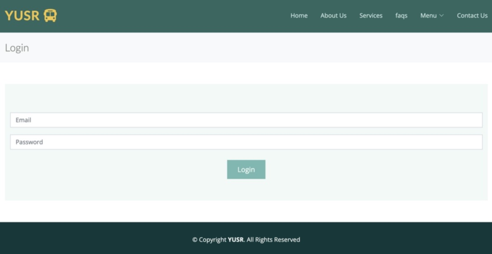
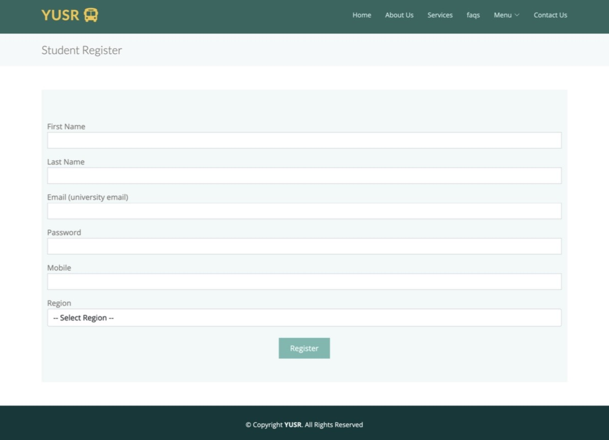
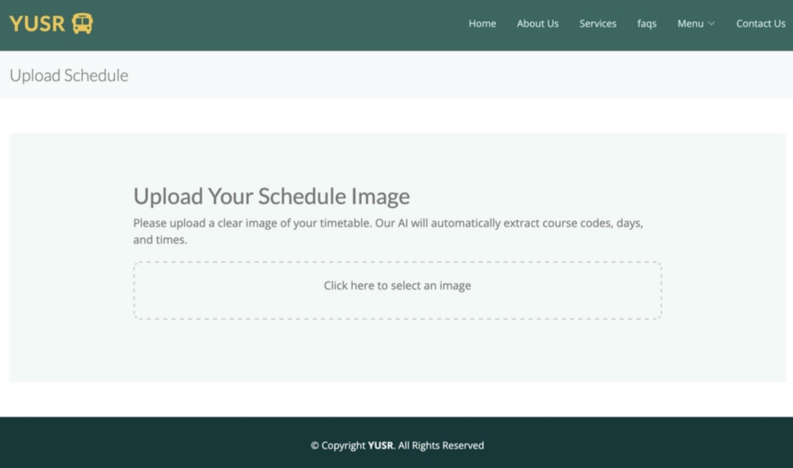
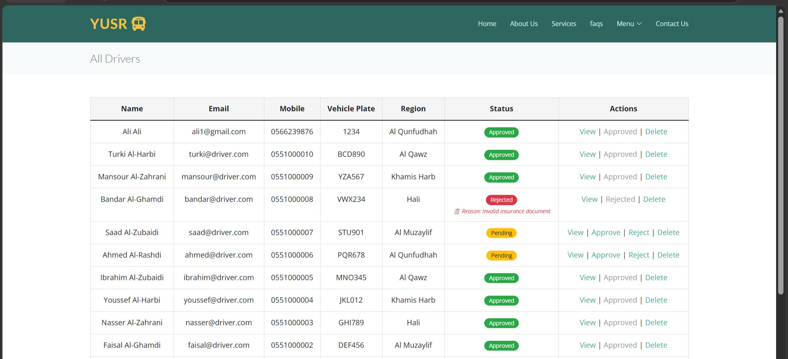
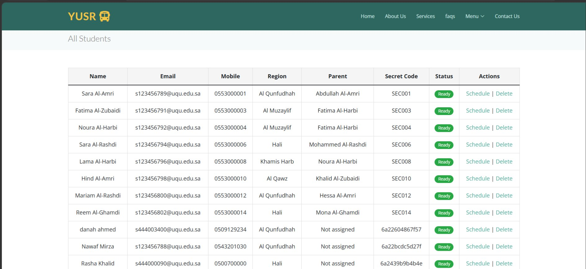
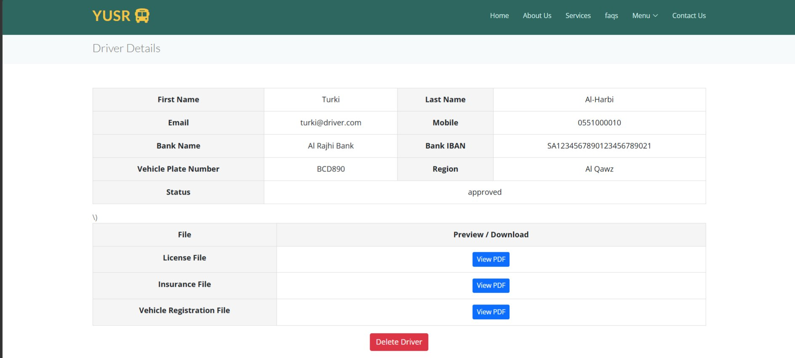

# Yusr-Smart-Transportation-System-for-University-Students
Graduation project that streamlines university transportation by organizing student trips based on class schedules, OCR timetable recognition, GPS tracking, and driver management.
# Yusr – Smart Transportation System for University Students

## Overview

Yusr is a graduation project developed to simplify university transportation for students by organizing daily trips based on class schedules.

The system automatically groups students according to:
- Class schedules
- Pickup locations
- Trip timings

This helps reduce transportation conflicts and improve trip organization.

---

## Features

- OCR timetable recognition
- Student trip management
- Driver assignment
- GPS tracking
- Notifications
- Schedule management
- User-friendly interface

---

## Technologies Used

- HTML
- CSS
- JavaScript
- PHP
- MySQL

---

## Team

- Shaima Lafi Al-Zubaidi
-Remas Mohammed Al-Sefri 
-Sarah Abdullah Al-Amari
-Aryam Yassin Alajlani
-Danah Ahmed Bazghayfan

---

## Project Status

Graduation Project – Completed

## 📸 Screenshots

### 🔐 Login Page

### 👩‍🎓 Student Registration

### 📅 Upload Class Schedule

### 🚍 Student Trip Dashboard
Displays the student's information, trip status, pickup details, and estimated bus arrival time.

### 👨‍✈️ Driver Information (Admin Panel)
Allows the administrator to view driver details.

### 🚐 All Drivers
Admin interface for viewing all registered drivers.

### 👩‍🎓 All Students
Admin interface for viewing all registered students.

### 🛣️ Student Trips
Shows all trips assigned to students.

### 🚌 Trip Details
Displays trip information for a specific student.

### 📍 Another Student Trip
Another example of the trip information page.

